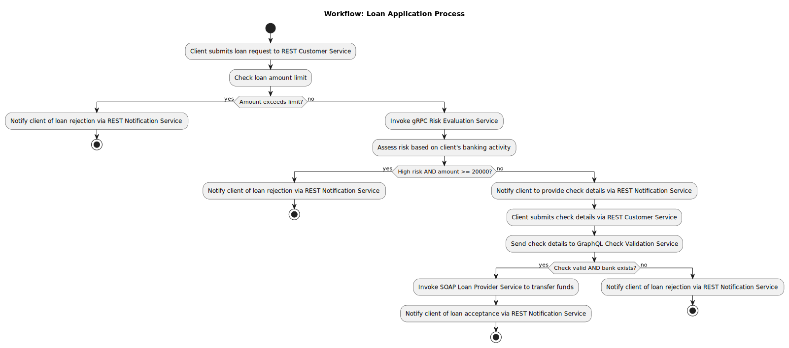
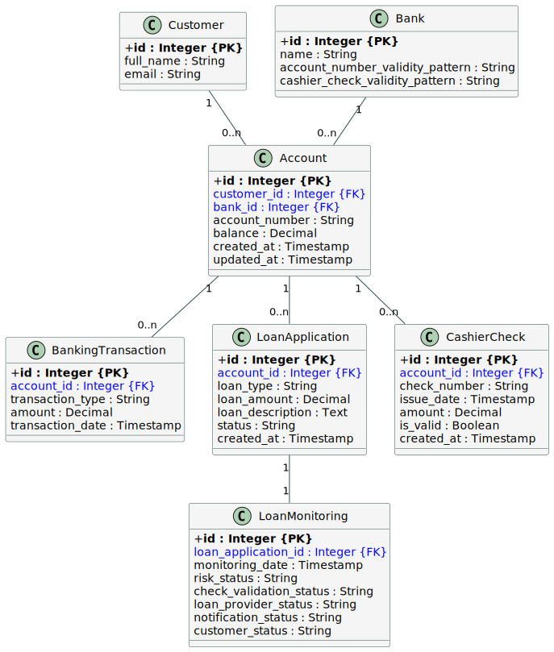

# Loan_Process_Microservices

## Overview

**Loan_Process_Microservices** is a microservices-based solution for simulating a loan request and approval workflow in a financial services context.

The project is designed around a distributed architecture where different components communicate through REST, SOAP, gRPC, and GraphQL APIs. Each service is containerized using Docker and orchestrated using Docker Compose. The backend uses a PostgreSQL database for persistence.

---

## Original Project Subject
Consider a scenario where a financial services firm offers to its customers a loan request service as following:

1. Firstly, the customer completes a form including his ID, personal information, loan type (personal or commercial), loan amount and brief loan description.
2. The financial services firm checks its maximum loan amount. If the customer loan amount is higher, the loan request is cancelled and the customer is notified.
3. Otherwise, the “customer financial profile” activity is called from a partner service to determine the risk level of the customer based on his banking activities.
4. If the customer risk level is “high” and the loan amount >= 20000, the loan is automatically declined.
5. Otherwise, the customer is requested to submit a cashier's check.
6. The financial services firm contacts the bank service to validate the received check. In case, it is validated, the loan is approved, otherwise the loan is declined.
7. In the approval case, the financial services firm requests the loan amount from its own provider and sends it to the customer's bank account.
8. Finally, the customer is notified about the firm decision (approval or rejection).

---

## Project Goals

This project aims to:

- Simulate a loan request process from customer input to final decision.
- Decompose business functionalities into dedicated microservices.
- Demonstrate interaction between REST, SOAP, gRPC, and GraphQL APIs.
- Use Docker for containerization and Docker Compose for orchestration.
- Implement clean and scalable service boundaries to respect **single responsibility** principle

---

## Architecture (Microservices & Responsibilities)

Each major functionality from the scenario is assigned to a dedicated service:

### 1. **Customer Service (REST)** ADAM
- Handles customer loan requests (ID, personal info, loan type, amount, description, etc...).
- Validates the maximum allowed loan amount.
- Coordinates the loan process by calling other services.
- **Reason for REST:** Public-facing service with standard HTTP operations and high accessibility.

### 2. **Risk Evaluation Service (gRPC)** ADAM
- Analyzes the customer’s financial profile and returns a risk level.
- Simulates interaction with a partner system.
- **Reason for gRPC:** Fast, efficient, internal communication ideal for service-to-service RPC.

### 3. **Check Validation Service (GraphQL)** LOUIS
- Validates the cashier's check submitted by the customer.
- Simulates interaction with an external banking service.
- **Reason for GraphQL:** Offers flexible querying for validation results with nested data structures.

### 4. **Loan Provider Service (SOAP)** ADAM
- Requests the loan amount from the financial firm’s provider.
- Simulates fund transfer to the customer’s account.
- **Reason for SOAP:**  This service simulates a legacy external system (e.g., a traditional bank API) that exposes only a SOAP interface, which is common in older financial infrastructures.

### 5. **Notification Service (REST)** LOUIS
- Notifies the customer (by mail) about loan approval or rejection.
- Can be internal or expose a small API.
- Uses SendGridAPI for email notifications.
- **Reason for REST:** Simple, loosely coupled notification trigger with potential future externalization.

### 6. **PostgreSQL Database** ADAM
- Stores customer profiles, loan requests, and decision history.
- **Reason:** Reliable relational model to track structured and linked financial data.

---

## Public API Exposure & Security

In this microservice architecture, **only the `Customer Service` exposes a public REST interface**. This API provides standard **CRUD endpoints** to manage core entities such as:

- Customers
- Banks
- Accounts
- Cashier's Checks
- Loans (Applications and Monitoring)
- Banking Transactions

It acts as the **primary entry point** for external systems or users interacting with the loan application process.

All other microservices—such as:

- `Risk Evaluation Service` (gRPC),
- `Check Validation Service` (GraphQL),
- `Loan Provider Service` (SOAP),
- `Notification Service` (REST, internal only)

are designed to be **internal-only** and not publicly exposed.

> This design ensures strict **encapsulation** and promotes the **principle of least privilege**, where only essential APIs are exposed externally.

---

## BPMN Workflow Integration

To orchestrate and visualize the business process across microservices, the project will include a **BPMN workflow layer** using **Camunda Platform 8 (Zeebe)**.

Camunda will provide:

- **Visual modeling** of the entire loan process (`.bpmn` files).
- **Process monitoring UI** via Camunda Operate.
- **Orchestration via Service Tasks**, calling microservices over REST.
- **Independent workflow layer** decoupled from business logic.
- **Full traceability** of process instances from start to decision.

This integration will be done **after core microservices are stable**, so the BPM engine can serve purely as an orchestrator.

Camunda services will be hosted in Docker and either included in the main Compose file or managed under a separate `camunda/` folder. Services planned:

- `zeebe` (workflow engine)
- `operate` (monitoring UI)
- `modeler` (Desktop or web tool to design BPMN files)
- BPMN diagrams will be stored in `camunda/processes/`.

Documentation **Camunda Platform 8** `docker compose` : https://docs.camunda.io/docs/self-managed/setup/deploy/local/docker-compose/

This integration will be done **after core microservices are stable**, so the BPM engine can serve purely as an orchestrator.

---

## Stack & Tools

- **Docker**: Containerization of all services.
- **Docker Compose**: Service orchestration and local development environment.
- **PostgreSQL**: Relational database.
- **REST (FastAPI/Python)**: For main HTTP interfaces.
- **SOAP (Python)**: For legacy external service simulation.
- **gRPC (Python)**: For performant internal communication.
- **GraphQL (Python/Strawberry)**: For structured and flexible queries.

---

## Hypothetical Project Structure
```
Loan_Process_Microservices/
    ├── .env                           # Environment variables for Docker/services
    ├── .gitignore                     # Git ignored files
    ├── docker-compose.yml             # Main orchestration file for services
    ├── openapi.json                   # OpenAPI specification of Customer Service for importing into Postman to test APIs
    ├── README.md                      # Project documentation
    ├── run.sh                         # Script to start all services
    ├── stop.sh                        # Script to stop all services
    ├── SQL_Relational_UML.svg         # UML diagram for SQL schema
    ├── SQL_Relational_UML_code.puml   # UML code source (PlantUML)
    ├── Workflow_Loan_Application_Process.svg # BPMN process diagram
    ├── customer_service/              # FastAPI REST microservice for core loan/customer logic
    │   ├── app/
    │   │   ├── main.py                               # FastAPI app entrypoint
    │   │   ├── routes/                               # REST API endpoints
    │   │   ├── services/                             # Business logic layer
    │   │   ├── models/                               # Pydantic data models
    │   │   ├── orm/                                  # ORM mapping via SQLAlchemy
    │   │   ├── db/                                   # Database connection setup
    │   │   ├── error_handling/                       # Custom error types and handlers
    │   │   ├── risk_service_grpc_client/             # gRPC client to Risk Service
    │   │   ├── risk_service_proto_client/            # gRPC proto files
    │   │   ├── loan_provider_service_soap_client/    # SOAP client to external provider
    │   │   ├── check_validation_service_graphql_client/ # GraphQL client to validation service
    │   │   └── notification_service_client/          # REST client for notifications
    ├── risk_service/                 # gRPC-based risk analysis service
    │   ├── app/
    │   │   ├── main.py               # gRPC server entrypoint
    │   │   ├── service/              # Risk evaluation logic
    │   │   ├── proto/                # gRPC proto definitions
    │   │   ├── orm/                  # ORM mapping
    │   │   └── db/                   # Database setup
    ├── check_validation_service/    # GraphQL-based data validation service
    │   ├── app/
    │   │   ├── main.py               # Strawberry GraphQL server
    │   │   ├── schema/               # GraphQL schema definition
    │   │   ├── resolvers/            # Query/mutation resolvers
    │   │   ├── orm/                  # ORM mapping
    │   │   └── db/                   # Database setup
    ├── loan_provider_service/       # SOAP interface for external loan providers
    │   ├── app/
    │   │   ├── main.py               # SOAP-like endpoint simulation
    │   │   ├── services/             # Loan provider call logic
    │   │   ├── error_handling/       # SOAP error definitions
    │   │   ├── orm/                  # ORM mapping
    │   │   └── db/                   # Database setup
    ├── notification_service/        # Lightweight REST service for notifications
    │   ├── app/
    │   │   ├── main.py               # FastAPI notifier service
    │   │   ├── models/               # Notification model (e.g., email, SMS)
    │   │   ├── services/             # Notification sending logic
    │   │   └── routes/               # API routes for triggering notifications
    ├── db/                           # SQL database initialization scripts
    │   ├── init.sql                  # Initial schema setup
    │   └── sample_data.sql           # Sample data for demo/testing
    └── camunda/                      # BPMN workflow orchestration with Camunda
        ├── docker-compose.yaml       # Camunda stack configuration
        ├── docker-compose-core.yaml  # Camunda core services
        ├── docker-compose-web-modeler.yaml # Web modeler configuration
        ├── .optimize/                # Camunda Optimize config
        ├── .web-modeler/             # Camunda Modeler environment settings
        ├── connector-secrets.txt     # Secrets for connectors
        └── README.md                 # Camunda-specific documentation
```
---

## Workflow (Microservices orchestration)

The following diagram illustrates the end-to-end workflow of the loan application process, showcasing the interactions between the microservices and decision points.



---

## SQL Schema UML Diagram

To better understand the database structure and relationships, an **UML diagram** will be created for the SQL schema. This diagram will visually represent the tables, their attributes, and the relationships between them (e.g., primary keys, foreign keys).



---

## How to run the project
To run the project, follow these steps:

1. Execute the `run.sh` script located at the root of the project:
    ```bash
    ./run.sh
    ```
    This script will start both the Docker Compose stack for the microservices and the Camunda BPMN engine.

2. Once the services are up, you can:
    - Access the Camunda Operate UI to launch and monitor workflows by navigating to the provided URL (e.g., `http://localhost:8081`).
    - Interact with the APIs of the Customer Service through its Swagger documentation (e.g., `http://localhost:8000/docs`).
    - Access the PostgreSQL database using Adminer at `http://localhost:8080`.

3. To stop the services (microservices and Camunda), run the `stop.sh` script located at the root of the project:
    ```bash
    ./stop.sh
    ```

All microservice ports are defined in the `.env` file, and you can modify them as needed. The Camunda BPMN ports are explained in the official documentation highlighted above.

**Make sure Docker and Docker Compose V2 are installed and running on your system before executing the script.**

---

## API Testing with Postman (Customer Service)

To test the Customer Service REST API efficiently, you can use **Postman** by importing the provided OpenAPI specification.

### How to Import `openapi.json` in Postman

1. Open **Postman** and click on **Import**.
2. Choose **"File"** if you have the local `openapi.json`
3. Postman will automatically generate a collection titled **Customer Service REST API**, containing all available endpoints.

### Main Endpoints for Simulating the Loan Process

After importing, focus on these key **POST** routes available under `loan-process` and `cashier-checks`:

#### `POST /loan-process/first-part`
- **Name in Postman**: `Loan Process First Part`
- **Description**: Initiates the loan request.
- Accepts customer loan data (account number, loan type, amount, description).
- Checks maximum allowed amount.
- Triggers internal gRPC call to the Risk Evaluation Service.

#### `POST /cashier-checks/generate`
- **Name in Postman**: `Generate Cashier Check`
- **Description**: Simulates the creation of a cashier’s check after a risk-accepted application.
- This mimics customer-side submission before bank-side validation.

#### `POST /loan-process/second-part`
- **Name in Postman**: `Loan Process Second Part`
- **Description**: Completes the loan process.
- Validates the cashier’s check via the Check Validation GraphQL Service.
- Requests the loan from the Loan Provider SOAP service.
- Sends a notification to the customer via email with SendGridAPI.

---

Stay tuned for more updates as the implementation progresses.
